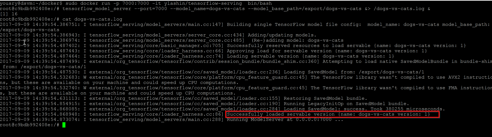

# Create a docker image to serve trained model using TensorFlow Serving

## Background
We can host TensorFlow in one or more Ubuntu VMs in Azure but that would be probably a waste of resources.
The better option is to create a docker cluster managed by Kubernetes or Swarm and host TensorFlow Serving in the containers of that cluster. We will use Kubernetes as it is easy to deploy and we can have high availability with little effort.

We will still make use of the data science virtual machine we have although you can use your laptop/PC assuming you can download the trained network file. But the VM is preferred as we will need to upload the file image to DockerHub and this needs a good uplink speed to do it quickly.

## Install docker on VM

Open an SSH session to the VM, the IP will be in Azure Portal and you should remeber the credential.
Use Putty or whatever SSH client you like and after logged in run the below to install DockVM.

```
Wget https://download.docker.com/linux/ubuntu/dists/xenial/pool/stable/amd64/docker-ce_17.03.2~ce-0~ubuntu-xenial_amd64.deb

sudo dpkg -i docker-ce_17.03.2~ce-0~ubuntu-xenial_amd64.deb
```

## Create TensorFlow Serving docker image

The next step is to pull a Docker image prepared by Google that has all the requirements to run TensorFlow Serving. We will then build this image and give it a new tag.
```
cd ~
mkdir docker-images
cd docker-images
wget https://raw.githubusercontent.com/tensorflow/serving/master/tensorflow_serving/tools/docker/Dockerfile.devel
sudo docker build --pull -t ylashin/tensorflow-serving-devel -f Dockerfile.devel .
```

Then let's run a container based on this image which will connect us to a bash prompt inside this container.

```
sudo docker run -it ylashin/tensorflow-serving-devel
```


TensorFlow Serving can be installed by pulling and compiling source code from GitHub or by installing it using `apt-get`, we will follow the latter appraoch. A tiny note also, we will have to install `sudo` inside the container as it does not come by default.

```
apt-get update && apt-get install -y sudo && rm -rf /var/lib/apt/lists/*

echo "deb [arch=amd64] http://storage.googleapis.com/tensorflow-serving-apt stable tensorflow-model-server tensorflow-model-server-universal" | sudo tee /etc/apt/sources.list.d/tensorflow-serving.list

curl https://storage.googleapis.com/tensorflow-serving-apt/tensorflow-serving.release.pub.gpg | sudo apt-key add -

sudo apt-get update && sudo apt-get install tensorflow-model-server

tensorflow_model_server
```

The last line above should run and give no errors meaning TensorFlow Serving is correctly installed inside the container.

## Install TensorFlow and Keras in the container

Next we will install TensorFlow & Keras inside the container. We will not be doing any training here but they are meeded to exported the trained network file into a format understandable by TensorFlow Serving.

```
pip install --upgrade pip
sudo pip install h5py
sudo pip install tensorflow
sudo pip install keras 
```

## Export trained network to TensorFlow Serving format

In another SSH window to data science VM run the following to copy the trained network file inside the container.
First run the below to find current container name which will be needed to run docker copy command

```
sudo docker ps
```

Then use the container name shown in the result table of the above command instead fo dreamy_hopper below.
Effectively this will copy the model persisted file from the host VM into the container root folder.

```
sudo docker cp "/home/yousry/notebooks/Keras/dogs-vs-cats-inception.hdf5" dreamy_hopper:/
```

Switch back to the container window. We will be downloading a small Python script that will take that Keras persisted model and save it in a format suitable for TensorFlow Serving. The export path should end with a number denoting the version of exported model.

```
wget https://yousrysa.blob.core.windows.net/dogs-vs-cats/ExportKerasModelToServingFormat.py
python ExportKerasModelToServingFormat.py
ls /export/dogs-vs-cats/1
```

## Saving the container

Switch to the other window for the data science VM and execute the following to commit the current running container.

```
sudo docker ps
sudo docker commit 6ba36c40baf9 ylashin/tensorflow-serving
```

You should change the name `ylashin/tensorflow-serving` but most importantly you need to replace the random string of container ID with the ID for the container you have and `docker ps` command is used to display all running containers.

Now if you execute `sudo docker images` you should get something like:


Switch back to the container window and type `exit` to exit and stop that container, we already have a saved image of it.

## Testing the new container

In this step we will test that the new container has the latest changes, can run TensorFlow Serving with the needed model and will be reachable on any external port we specify.

In any bash window on data science VM, run the below (you might need to replace the image name with your value provided in `docker commit` step):

```
sudo docker run -p 7000:7000 -it ylashin/tensorflow-serving  bin/bash

tensorflow_model_server --port=7000 --model_name=dogs-vs-cats --model_base_path=/export/dogs-vs-cats &> /dogs-vs-cats.log &

cat dogs-vs-cats.log 
```

The last part of `tensorflow_model_server` command is to throw logs in a file and the next line is to show the contents of that file.
If you see a line with a successful message containing the model name and its version then we should be fine.



Now we can exit the container knowing that it is in a good shape.

## Publish image to docker
You will need to have an account in DockerHub for this step. Publishin the image to docker hub is simply required so that it will be available to consumed globally and in out scenario to build Docker cluster in Azure using Kuberenetes. Same disclaimer applies eveywhere I will not mention it again, use your own image name instead of mine.

Run the below a shell window connected to the data science VM.
```
sudo docker login 
sudo docker push ylashin/tensorflow-serving
```

Once pusblish proceed to the next step [Create a Kubernetes cluster to host TensorFlow Serving](4.CreateKubernetesCluster.md).