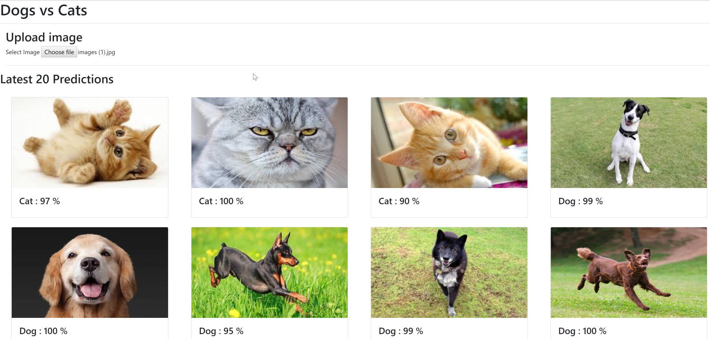
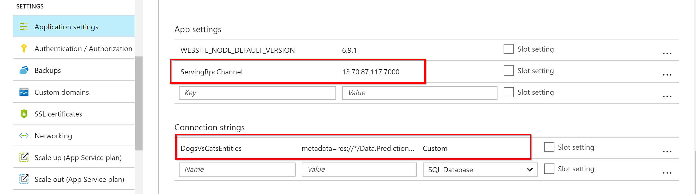

# Consume trained model from a .NET application using gRPC protocol

Let's start with the final result so we can imagine what is our target here.



**Disclaimer:**
I am assuming some familiarity with Azure and ASP.NET web applications but the whole workflow can be ported to other tech stacks like nodejs or java.

The final result is a web application hosted locally or in Azure.
You can find the source code of this application [here](./WebApp).

Pretty lame UI but all we need is a file select button to upload an image. Uploaded image will be fed to the prediction service served by TensorFlow Serving (too much serving here but cannot help it). Anyway, prediction result is two probabilities one for cat and one for dog and based on their values we will show the dog/cat label. 

e.g. If dog probability is 95% then cat probability by definition will be 5% and we will show a dog label with 95% probability.

Just to get an idea of the design of this application:

* Front end is a simple Angular 1.x simple app with Bootstrab styling
* Backend is ASP.NET Web API that saves images and predictions to SQL database
* ORM is EF using the old style load model from database approach
* Prediction is done by C# proxy classes generated by gRPC nuget package, I will come to that later.

Let's discuss some of the above in more detail.

## Calling TensorFlow Serving

TensorFlow Serving exposes models via a Google developed protocol called gRPC. gRPC is a high performance, open-source universal RPC framework that is used extensively by Google. Fortunately there is support for many languages and for C# we have the needed nuget libraries to act as a server or as a client for gRPC. For our case we need to generate client proxy classes to call TensorFlow Serving. If you remeber the tools to generate proxy classes from WSDL or WCF definition then I can stop here. Simply, there is a tool to feed with service definition (called protocol buffers) and it will outcome client proxy classes. I have already done this step but if you want more details here you go.

Protcol buffer files for TensorFlow Serving can be found in [here](https://github.com/tensorflow/serving/tree/master/tensorflow_serving/apis).

A cleaner copy that is easy to work with can be found in [this](https://github.com/krystianity/keras-serving/tree/master/node_server/protos) GitHub repo. It simply the same files from Google TensorFlow Serving but kind of self contained so you do not need to handle references to other Google repos/libraries.

Once you download those protocol buffer files you can process them with the command below to generate C# client proxy classes:

```
protoc.exe "prediction_service.proto" "predict.proto" "model.proto" "resource_handle.proto"   --csharp_out "C:\Temp" --grpc_out "C:\Temp" --plugin=protoc-gen-grpc=packages\Grpc.Tools.1.4.1\tools\windows_x86\grpc_csharp_plugin.exe
```

Once you restore all the nuger packages of the web application, those protoc.exe & grpc_csharp_plugin.exe will be available in packages folder.

For more details on gRPC with C# please have a look on [gRPC C# quick guide](https://grpc.io/docs/quickstart/csharp.html).


## Database

We will need a SQL database to store images and predictions. If hosting locally, we can use any local SQL server database. If hosting in Azure, we need a SQL Azure database. I am lazy so no database migratiosn here.

Simply create a new database named `DogsVsCats` or any other name as long as you will update the connection string in web.config file. Anyway, create the below single table in this database:

```
CREATE TABLE [dbo].[Prediction](
	[Id] [uniqueidentifier] NOT NULL,
	[FileName] [nvarchar](200) NOT NULL,
	[ContentType] [nvarchar](200) NOT NULL,
	[Data] [varbinary](max) NOT NULL,
	[CreatedOn] [datetimeoffset](7) NOT NULL,
	[DogProbability] [float] NOT NULL,
	[CatProbability] [float] NOT NULL,
    CONSTRAINT [PK_Prediction] PRIMARY KEY CLUSTERED 
    (
        [Id] ASC
    )
) 
```

As mentioned above, if hosting locally you will need to update the connection string in web.config. In Azure, you can update the connection string as part of the publishing itself but it did not work smoothly with me so I used another approach.

You can override any app settings or connection string for an app service in Azure from the application settings page.

Mainly we will need to fill the correct SQL Azure connection as part of EF connection string. Also although not part of the database setup, we should add a key called `ServingRpcChannel` and fill it as the the external IP of Kubernetes cluster plus a color plus port 7000.



## Calling TensorFlow Serving using gRPC

Once the client proxy files are ready, calling our prediction service should be somehow similar to consuming any other ASMX/WCF service. There is still a few small caveats:

1. Images will be first resized to 299x299 pixels as this is the expectation for InceptionV3 model
1. Pixel values will be preprocessed as below
    ```
    // This is needed as inception model is trained with input procprocessed
    // to be standardised with mean of 0 and ranging from -1 to 1
    private float AdjustPixel(float pixel)
    {
        return ((pixel / 255.0F) - 0.5F) * 2;
    }
    ```
1. TensorFlow (or maybe the InceptionV3 model) takes image data as 3 dimensional array as (hieght x width x colour channels). In our client we will flatten this data but it will be flattened column by column not row by row.
    ```
    private void GetData(Bitmap myBitmap, TensorProto proto)
    {
        // Important : load data column by column
        for (var i = 0; i < myBitmap.Width; i++)
        {
            for (var j = 0; j < myBitmap.Height; j++)
            {
                Color pixelColor = myBitmap.GetPixel(j, i);
                proto.FloatVal.Add(AdjustPixel(pixelColor.R));
                proto.FloatVal.Add(AdjustPixel(pixelColor.G));
                proto.FloatVal.Add(AdjustPixel(pixelColor.B));
            }
        }
    }
    ```

## Configuration values

Web config file has the below keys in addition to the connection string.

```
<add key="ServingRpcChannel" value="13.70.87.117:7000"/>
<add key="ModelName" value="dogs-vs-cats"/>
<add key="ModelVersion" value="1"/>
<add key="ModelSignature" value="predict"/>
<add key="ModelInputName" value="inputs"/>
<add key="ImageWidth" value="299"/>
<add key="ImageHeight" value="299"/>
```

The ones starting with `Model` has their values based on the steps for exporting the model file and running TensorFlow Model Server command with a certain model name. Signature and input name are part of the Python script used to convert Keras saved model to TensorFlow Serving consumable model. Image width & height are inherent properties of Inception V3 network which we used to do transfer learning.


## Running the application

You should open the solution file in VS and build it. This will restore nuget packages and assuming you have the database and configuration values setup either locally or in Azure you should be able to browser that super simple application and upload images for your lovely cat/dog pets and get decent prediction quality.


