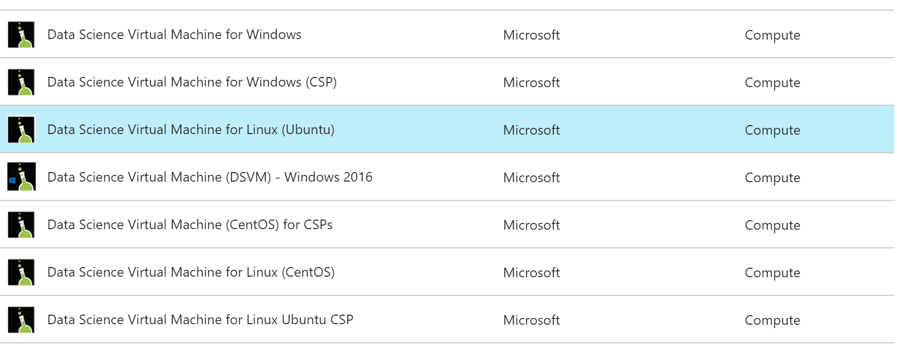
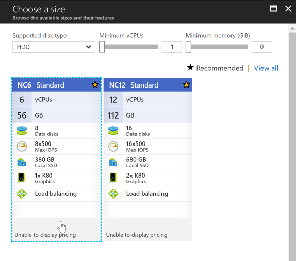

# Setup Azure Data Science Virtual Machine

We can develop deep learning solution locally on our laptops but this needs lots of effort to setup development libraries and tools plus we will need a decent GPU to work quickly. The other option is to use the cloud. There are many options from all cloud providers but we will be using Azure data science virtual machine here. It's a virtual machine image provided from Microsoft with all the following pre-installed:

* NVIDIA libraries and drivers (The VM will have a GPU for sure)
* Deep learning libraries like TensorFlow, CNTK and Keras
* Jupyter notebooks and JupyterHub which allows remote notebook access.

I will be very brief here assuming the reader has some familiarity with Azure but the steps are really trivial.

## VM Creation
1. Using Azure portal, trigger create VM wizard & search for Data Science virtual machine using the Ubuntu template.

1. During the creation wizard, pick **HDD** for the hard disk types as for some reason GPU VMs 
do not work with SSD hard disks or maybe not yet available.
1. For the location of the VM, pick `South Central US` as not all regions have GPU enabled VMs.
   This is not the only region with GPU enabled VMs but just to make things easy for you.
1. For the step of selecting VM size, choose NC6 or any other size you like provided it has one of the NVIDIA cards included.

1. Continue all remaining steps of the wizard and wait for the VM to be created.
 
## VM Preparation

Once the VM has been created a new window will be opened in Azure portal showing some details like the public IP of the created VM. We can RDP into it using tools like X2GO or whatever tool you prefer to connect to Ubuntu but we can do almost everything without a local GUI session.

First find out the public IP of the VM and try to hit the below in another browser tab:

https://[virtual machine public IP]:8000

If it opens Jupyter then you are fine.

Jupyter zure hub can be accessed on URL https://13.84.185.184:8000 and the credentials are the same used by your VM login. Just ignore browser certificate warnings if you face them

Create a new folder called Keras

You can copy the notebooks in this repo into this folder and refresh your browser session to see them. If you are using Putty or an SSH tool you can use wget to download them from GitHub or of you RDP using a GUI client, you can use the browser to download the whole repo and save them in Keras folder

Run all the notebooks. The final notebook will generate a file containing the final trained model we can use in a docker container with TensorFlow serving. 